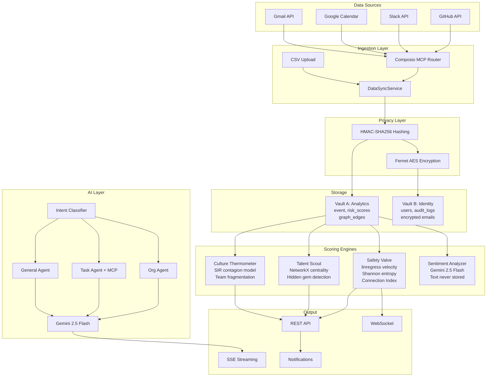
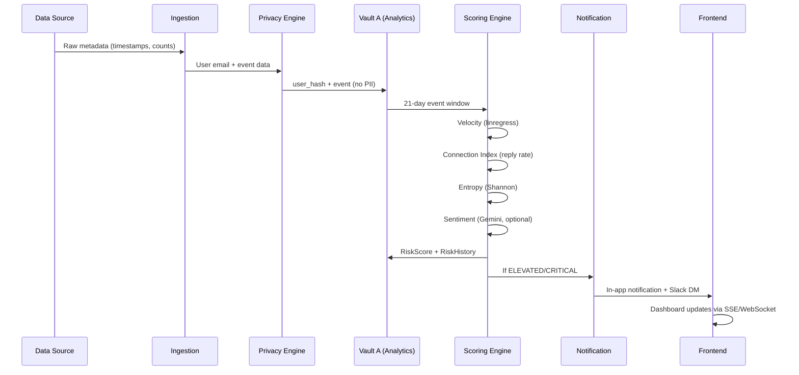

# Sentinel Backend -- AI-Powered Employee Insights

> Detect burnout before it happens. Sentinel analyzes behavioral metadata from workplace tools to surface individual risk, hidden talent, and team-level contagion -- without ever reading message content.

## Overview

Sentinel is a FastAPI backend that powers an AI-driven employee wellbeing platform. It ingests behavioral metadata (commit timestamps, meeting frequency, response patterns) from GitHub, Slack, Google Calendar, and Gmail, then runs three analytical engines to produce actionable insights for managers and HR leaders.

The system operates under a strict privacy-first constraint: **no message content is stored**. All analysis runs on metadata patterns, timestamps, and interaction graphs. Identity data is encrypted and separated from analytics data by design.

---

## Architecture

### System Architecture



### Data Flow



### Three Engines

Each engine uses a different mathematical model to detect a distinct risk signal.

| Engine | What It Detects | Math |
|---|---|---|
| **Safety Valve** | Individual burnout risk via "Sentiment Velocity" | SciPy `linregress` for velocity slope, Shannon entropy for circadian disruption, calibrated sigmoid for attrition probability |
| **Talent Scout** | Structurally critical "hidden gems" in the collaboration network | NetworkX betweenness centrality + eigenvector centrality on a directed weighted graph |
| **Culture Thermometer** | Team-level burnout contagion spread | SciPy `odeint` solving SIR (Susceptible-Infected-Recovered) differential equations |

### 3-Agent AI Orchestrator

The `/api/v1/ai/chat` endpoint routes each user message through a three-layer pipeline:

```
User Message
    |
    v
IntentClassifier (Gemini 2.5 Flash, temperature 0.1, JSON mode)
    |
    +---> org_agent    -- answers questions about people, teams, risk data
    +---> task_agent   -- executes external tool calls (Slack, Calendar, GitHub, Gmail) via MCP
    +---> general_agent -- handles greetings, off-topic, general conversation
```

Follow-up messages in the same session are automatically routed to the previous agent to preserve conversational context.

### Two-Vault Privacy Architecture

Analytics data (Vault A) and identity data (Vault B) live in separate database schemas with **no foreign key relationship**.

```
Vault A (Analytics)                  Vault B (Identity)
+---------------------------+        +---------------------------+
| user_hash  (HMAC-SHA256)  |        | user_hash  (HMAC-SHA256)  |
| velocity, risk_level      |        | email_encrypted (Fernet)  |
| events, graph edges       |        | name_encrypted  (Fernet)  |
| centrality scores         |        |                           |
+---------------------------+        +---------------------------+
         |                                     |
         +--------  NO FK LINK  ---------------+
         |  Linked only by HMAC-SHA256(email, VAULT_SALT)  |
```

A database breach yields only anonymous hashes in Vault A and AES-128-CBC encrypted blobs in Vault B. Decrypting identity requires both the `ENCRYPTION_KEY` and `VAULT_SALT`, which are never stored alongside the database.

### Composio MCP Tool Router

External tool integration uses the [Composio](https://composio.dev) MCP (Model Context Protocol) Tool Router. When a user connects GitHub, Slack, Calendar, or Gmail through the marketplace:

1. A per-user MCP session is created with Composio's Tool Router SDK
2. The session exposes an MCP endpoint (URL + auth headers) that the LLM can call
3. The Task Agent uses Gemini's function-calling to autonomously discover and invoke tools
4. Sessions are cached in-memory with a 30-minute TTL and invalidated on tool connect/disconnect

### Middleware Stack

Requests pass through five middleware layers in order:

1. **RequestIDMiddleware** -- assigns a unique `X-Request-ID` to every request
2. **SecurityMiddleware** -- input sanitization and security headers
3. **TenantContextMiddleware** -- JWT verification and tenant scoping
4. **RateLimitMiddleware** -- per-IP and per-user rate limiting
5. **CORSMiddleware** -- cross-origin request handling

---

## Tech Stack

| Layer | Technology | Version |
|---|---|---|
| Language | Python | 3.12 |
| Framework | FastAPI | 0.109 |
| Database | PostgreSQL (via Supabase) | 14+ |
| ORM | SQLAlchemy | 2.0 |
| Cache | Redis | 7+ |
| LLM | Google Gemini 2.5 Flash | via OpenAI-compatible endpoint |
| AI Gateway | Portkey | optional, for routing and fallback |
| Graph Analysis | NetworkX | 3.2 |
| Numerical | NumPy, SciPy | 1.26, 1.12 |
| Tool Integration | Composio MCP | 1.0+ |
| Auth | Supabase Auth + JWT (HS256) | -- |
| SSO | Google OAuth, Azure AD, SAML | -- |

---

## External APIs and Setup

### Required

| API | Purpose | How to Get Key |
|---|---|---|
| **Supabase** | PostgreSQL database + Auth | 1. Create a project at [supabase.com](https://supabase.com). 2. Go to Settings > API to copy the Project URL, anon key, and service role key. 3. Go to Settings > Database for the connection string (use "Session mode" URI). |
| **Gemini** | LLM for AI chat, intent classification, sentiment analysis | 1. Go to [aistudio.google.com/app/apikey](https://aistudio.google.com/app/apikey). 2. Click "Create API Key". 3. Copy the key (starts with `AIza`). |

### Optional

| API | Purpose | How to Get Key |
|---|---|---|
| **Composio** | External tool integration (GitHub, Slack, Calendar, Gmail) via MCP Tool Router | 1. Sign up at [composio.dev](https://composio.dev). 2. Go to Dashboard > Settings > API Keys. 3. Copy your API key. |
| **Portkey** | AI gateway for LLM routing, fallback, and observability | 1. Sign up at [portkey.ai](https://portkey.ai). 2. Create virtual keys pointing to your LLM providers. 3. Copy the API key and virtual key from the dashboard. |
| **Redis** | Rate limiting, MCP session caching | Install locally (`brew install redis`) or use [Upstash](https://upstash.com) for a hosted free tier. Falls back to in-memory if unavailable. |
| **Google OAuth** | SSO login via Google | 1. Go to [console.cloud.google.com](https://console.cloud.google.com). 2. Create OAuth 2.0 credentials. 3. Copy the Client ID and Client Secret. |
| **Azure AD** | SSO login via Microsoft | 1. Register an app at [portal.azure.com](https://portal.azure.com). 2. Copy the Application (client) ID and Client Secret. |

### Environment Variables

All configuration is managed through environment variables loaded from a `.env` file. See [`.env.example`](.env.example) for the full template.

#### Required Variables

| Variable | Description | How to Generate |
|---|---|---|
| `DATABASE_URL` | PostgreSQL connection string | Supabase > Settings > Database > Session mode URI |
| `SUPABASE_URL` | Supabase project URL | Supabase > Settings > API |
| `SUPABASE_KEY` | Supabase anon/public key | Supabase > Settings > API |
| `SUPABASE_SERVICE_KEY` | Supabase service role key | Supabase > Settings > API |
| `JWT_SECRET` | JWT signing secret (32+ characters) | `python -c "import secrets; print(secrets.token_hex(32))"` |
| `VAULT_SALT` | HMAC salt for privacy hashing (8+ characters) | Any cryptographically secure random string |
| `ENCRYPTION_KEY` | Fernet key for PII encryption (44 characters, base64) | `python -c "from cryptography.fernet import Fernet; print(Fernet.generate_key().decode())"` |
| `GEMINI_API_KEY` | Google Gemini API key | [aistudio.google.com](https://aistudio.google.com/app/apikey) |

#### Optional Variables

| Variable | Default | Description |
|---|---|---|
| `COMPOSIO_API_KEY` | `""` | Enables external tool integrations (Slack, Calendar, GitHub, Gmail) |
| `REDIS_URL` | `redis://localhost:6379/0` | Redis for rate limiting and MCP session cache |
| `REDIS_PASSWORD` | `""` | Redis authentication password |
| `PORTKEY_API_KEY` | `""` | Portkey AI gateway for LLM routing and observability |
| `PORTKEY_VIRTUAL_KEY` | `""` | Primary model virtual key (Portkey dashboard) |
| `PORTKEY_FALLBACK_VIRTUAL_KEY` | `""` | Fallback model virtual key |
| `LLM_MODEL` | `gemini-2.5-flash` | Primary LLM model name |
| `LLM_FALLBACK_MODEL` | `gemini-2.0-flash-lite` | Fallback LLM model name |
| `LLM_API_KEY` | `""` | Alternative LLM API key (e.g., Groq) for direct calls |
| `SIMULATION_MODE` | `True` | Enables demo seed endpoints and simulation controls |
| `ENVIRONMENT` | `development` | Set `production` to enable HSTS headers |
| `SEED_PASSWORD` | `""` | Password assigned to seeded demo users |
| `ALLOWED_ORIGINS` | `http://localhost:3000,http://localhost:3001` | CORS allowed origins (comma-separated) |
| `LOG_LEVEL` | `INFO` | Logging level (`DEBUG`, `INFO`, `WARNING`, `ERROR`) |
| `MCP_SESSION_TTL_SECONDS` | `1800` | MCP Tool Router session cache TTL (seconds) |
| `MCP_LOCK_TIMEOUT_SECONDS` | `30` | MCP session creation lock timeout |
| `DATA_RETENTION_DAYS` | `90` | Number of days to retain behavioral event data |
| `MAX_LOGIN_ATTEMPTS` | `5` | Maximum failed login attempts before lockout |
| `LOCKOUT_DURATION_MINUTES` | `15` | Account lockout duration after max failed attempts |
| `ACCESS_TOKEN_EXPIRE_MINUTES` | `15` | JWT access token lifetime |
| `REFRESH_TOKEN_EXPIRE_DAYS` | `7` | JWT refresh token lifetime |

#### SSO Variables (all optional)

| Variable | Default | Description |
|---|---|---|
| `GOOGLE_CLIENT_ID` | `""` | Google OAuth client ID |
| `GOOGLE_CLIENT_SECRET` | `""` | Google OAuth client secret |
| `GOOGLE_ALLOWED_DOMAINS` | `""` | Comma-separated list of allowed Google domains |
| `AZURE_CLIENT_ID` | `""` | Azure AD application ID |
| `AZURE_CLIENT_SECRET` | `""` | Azure AD client secret |
| `AZURE_TENANT_ID` | `common` | Azure AD tenant ID |
| `SAML_ENTITY_ID` | `""` | SAML service provider entity ID |
| `SAML_SSO_URL` | `""` | SAML identity provider SSO URL |
| `SAML_CERTIFICATE` | `""` | SAML X.509 certificate |

---

## Setup and Installation

### Prerequisites

- Python 3.12+
- [uv](https://github.com/astral-sh/uv) package manager
- A [Supabase](https://supabase.com) project (free tier works)
- Redis 7+ (optional -- falls back to in-memory cache)

### Quick Start

```bash
# Clone the repository
git clone https://github.com/MohitGoyal09/algoquest-backend.git
cd algoquest-backend

# Install the uv package manager
pip install uv

# Install dependencies
uv sync

# Configure environment
cp .env.example .env
# Edit .env with your API keys (see Environment Variables section above)

# Start the server
uv run uvicorn app.main:app --reload --port 8000
```

The server starts on `http://localhost:8000`. Database tables are created automatically on first startup via `Base.metadata.create_all()`.

Verify the server is running:

```bash
curl http://localhost:8000/health
# {"status":"healthy","version":"1.0.0"}
```

### Seed Demo Data

```bash
python -m scripts.seed_fresh
```

This creates a complete demo environment with deterministic data (`Random(42)`):

- 1 tenant: **Acme Technologies** (enterprise plan)
- 15 users across 5 teams (Engineering, Design, Data Science, Sales, People Ops)
- Pre-computed risk scores, skill profiles, and centrality scores
- 624 behavioral events over 14 days with persona-driven patterns
- 450 risk history entries (30-day trends per user)
- 60 graph edges (team clusters + cross-team bridges)
- 116 audit logs covering 12 action types
- 2 pre-seeded chat sessions
- 69 notifications with 150 preferences

All demo users share the password `Demo123!`. Every run produces identical output.

### Docker

Build and run with Docker Compose:

```bash
docker-compose up --build
```

This starts three services:
- **backend** on port `8000` (the FastAPI application)
- **postgres** on port `5432` (PostgreSQL 16 database)
- **redis** on port `6379` (Redis 7 cache)

Run only the backend (when you have an external database):

```bash
docker build -t sentinel-backend .
docker run -p 8000:8000 --env-file .env sentinel-backend
```

---

## API Endpoints

All endpoints are prefixed with `/api/v1`. Full interactive docs are available at `http://localhost:8000/docs` once the server is running.

| Domain | Prefix | Description |
|---|---|---|
| Auth | `/auth` | Login, logout, refresh, password reset, email verification |
| SSO | `/sso` | Google OAuth, Azure AD, SAML authentication flows |
| Me | `/me` | Current user profile, personal risk score, skills, nudges |
| Team | `/team` | Team roster, aggregated risk, SIR contagion curve |
| Engines | `/engines` | Safety Valve, Talent Scout, Culture Thermometer data |
| AI / Chat | `/ai` | Streaming chat (SSE), session CRUD, intent routing |
| Ingestion | `/ingestion` | Behavioral event ingest pipeline |
| Admin | `/admin` | User management, RBAC, identity reveal, team management |
| Organizations | `/organizations` | Org-level settings and member management |
| Tenants | `/tenants` | Multi-tenant provisioning |
| Users | `/users` | User directory |
| Notifications | `/notifications` | In-app notifications and preference management |
| Analytics | `/analytics` | Event aggregates, trend data |
| Tools | `/tools` | Composio external tool execution and marketplace |
| ROI | `/roi` | Retention cost modelling |
| Connections | `/connections` | Graph edge data |
| Shadow | `/shadow` | Shadow deployment framework for accuracy validation |
| Demo | `/demo` | Demo reset and scenario controls |
| Workflows | `/workflows` | Async workflow status |

**WebSocket**: `ws://localhost:8000/ws/{user_hash}` for real-time risk updates.

---

## Design Decisions

### 1. Metadata-Only Analysis

Sentinel never reads message content. All signals (velocity, entropy, belongingness) are derived from timestamps, interaction counts, and graph topology. This makes deployment possible without accessing sensitive communications.

### 2. Two-Vault Privacy (No FK Between Analytics and Identity)

The `analytics` schema and `identity` schema have zero foreign key relationships. The only link is `HMAC-SHA256(email, VAULT_SALT)`. This means a database dump of the analytics schema reveals nothing about who the data belongs to.

### 3. HMAC-SHA256 Identity Hashing

User emails are hashed with a salted HMAC (not a plain hash) so that rainbow table attacks are infeasible. The salt (`VAULT_SALT`) is stored only in the application environment, never in the database.

### 4. Three-Signal Convergent Evidence

The Safety Valve does not flag burnout from a single metric. Risk classification requires convergence across three independent signals:
- **Velocity** > threshold (work intensity trend via linear regression)
- **Belongingness** < threshold (social withdrawal via interaction analysis)
- **Circadian Entropy** > threshold (schedule chaos via Shannon entropy)

### 5. Connection Index as Behavioral Sentiment Proxy

Rather than analyzing message tone (which would require reading content), Sentinel uses interaction graph metrics (reply rate, mention frequency, response latency) as a proxy for engagement and belongingness.

### 6. Opt-In Sentiment Analysis (Text Classified, Never Stored)

When users opt in, Slack messages are sent to Gemini for sentiment classification. The score (`positive`/`neutral`/`negative`) is stored; the message text is discarded immediately after classification. The `SentimentAnalyzer` class enforces this by design: text is a function parameter that goes out of scope after the API call.

### 7. SIR Epidemiological Model for Team Contagion

The Culture Thermometer uses a real SIR (Susceptible-Infected-Recovered) model from epidemiology to predict burnout spread through team networks. The model is calibrated from team graph data (average connections, average risk score) and solved with `scipy.integrate.odeint`.

### 8. Shadow Deployment Framework

A shadow deployment system allows new engine versions to run alongside production in read-only mode. Predictions from the shadow engine are compared against the live engine to validate accuracy before promotion.

### 9. Context-Aware Late Night Filtering

The Safety Valve filters out "explained" late-night work (e.g., scheduled deploys, on-call rotations) by cross-referencing with calendar events and PagerDuty incidents before calculating velocity. This reduces false positives from legitimate after-hours work.

---

## Project Structure

```
backend/
  app/
    api/
      v1/
        endpoints/        25 endpoint modules
      websocket.py        Real-time risk updates
    core/
      database.py         SQLAlchemy engine and session
      security.py         PrivacyEngine (HMAC, Fernet encrypt/decrypt)
      redis_client.py     Redis connection
      rate_limiter.py     Per-IP and per-user rate limiting
      vault.py            Vault abstraction
      supabase.py         Supabase client
    middleware/
      request_id.py       X-Request-ID assignment
      security.py         Input sanitization, security headers
      tenant_context.py   JWT verification, tenant scoping
    models/
      analytics.py        Events, RiskScore, GraphEdge, CentralityScore, RiskHistory
      identity.py         UserIdentity (encrypted PII)
      tenant.py           Tenant, TenantMember (RBAC: 52 permissions)
      team.py             Team model
      notification.py     Notifications and preferences
      chat_history.py     Chat sessions and messages
      workflow.py         Async workflow tracking
      invitation.py       Team invitations
    services/
      safety_valve.py     Burnout detection engine
      talent_scout.py     Network analysis engine
      culture_temp.py     Team contagion engine
      sir_model.py        SIR epidemic differential equations
      orchestrator.py     3-agent chat orchestrator
      intent_classifier.py  Gemini-based intent classification
      sentiment_analyzer.py Opt-in sentiment classification
      mcp_tool_router.py  Composio MCP session management
      data_sync.py        GitHub/Slack/Calendar/Gmail data ingestion
      llm.py              LLM service (Portkey + Gemini fallback)
      agents/             org_agent, task_agent, general_agent
      connectors/         Git, Slack, Gmail data normalization
    config.py             Pydantic settings (env var validation)
    main.py               FastAPI app, middleware, startup
  scripts/
    seed_fresh.py         Deterministic demo data seeder
    seed_master.py        Master seed orchestrator
    verify_seed.py        Seed data verification
    verify_encryption.py  Encryption key validation
  tests/
    test_permissions.py   52-permission RBAC matrix
    test_rbac.py          Role-based access control
    test_me_endpoints.py  Employee self-service API
    test_team_endpoints.py Team API
  Dockerfile              Multi-stage Python 3.12 slim build
  docker-compose.yml      Backend + PostgreSQL + Redis
  pyproject.toml          uv/pip dependencies
  requirements.txt        Pinned dependencies for Docker builds
```

---

## Testing

```bash
# Run the full test suite
pytest

# Run with coverage report
pytest --cov=app --cov-report=term-missing

# Run a specific test module
pytest tests/test_rbac.py -v
```

The test suite covers:
- Auth dependency injection
- RBAC and permissions (52-permission matrix across 3 roles)
- Tenant and team model operations
- Orchestrator intent classification
- Identity reveal authorization
- Employee self-service endpoints
- Team data access controls

### Manual Testing with Seed Data

```bash
# Seed the demo environment
python -m scripts.seed_fresh

# Verify the seed
python -m scripts.verify_seed

# Test the health endpoint
curl http://localhost:8000/health

# Test the readiness probe (checks DB + Redis)
curl http://localhost:8000/ready

# List engine data for all users (requires auth token)
curl -H "Authorization: Bearer <token>" http://localhost:8000/api/v1/engines/users
```

---

## Demo Credentials

All users belong to the **Acme Technologies** tenant. Password for all accounts: `Demo123!`

| Email | Name | Role | Team | Risk |
|---|---|---|---|---|
| `admin@acme.com` | Sarah Chen | Admin | -- | LOW |
| `cto@acme.com` | James Wilson | Admin | -- | LOW |
| `eng.manager@acme.com` | Priya Sharma | Manager | Engineering | ELEVATED |
| `dev1@acme.com` | Jordan Lee | Employee | Engineering | **CRITICAL** |
| `dev2@acme.com` | Maria Santos | Employee | Engineering | LOW |
| `dev3@acme.com` | David Kim | Employee | Engineering | ELEVATED |
| `dev4@acme.com` | Emma Thompson | Employee | Engineering | LOW |
| `designer1@acme.com` | Noah Patel | Employee | Design | LOW |
| `designer2@acme.com` | Olivia Zhang | Employee | Design | ELEVATED |
| `analyst1@acme.com` | Liam Carter | Employee | Data Science | LOW |
| `sales1@acme.com` | Ryan Mitchell | Employee | Sales | LOW |
| `hr1@acme.com` | Aisha Patel | Employee | People Ops | LOW |

**Key demo personas:**

- **Jordan Lee** (`dev1@acme.com`) -- CRITICAL burnout. Velocity 3.2, belongingness 0.25, chaotic hours (22:00-03:00). Primary Safety Valve demo subject.
- **Emma Thompson** (`dev4@acme.com`) -- Hidden gem. Betweenness 0.85, eigenvector 0.15, unblocking count 22. Bridges Engineering and Design. Primary Talent Scout demo subject.
- **Maria Santos** (`dev2@acme.com`) -- Healthy baseline. Velocity 0.6, belongingness 0.75. Consistent 9-5 pattern. Control group.
- **David Kim** (`dev3@acme.com`) -- ELEVATED warning. Velocity 2.0, hours trending up. Moving toward CRITICAL.

---

## Common Issues

**`ValueError: JWT_SECRET must be at least 32 characters`**
Generate a valid secret: `python -c "import secrets; print(secrets.token_hex(32))"`

**Database connection pool exhaustion under load**
The pool is configured conservatively (`pool_size=3`, `max_overflow=5`) for Supabase free tier limits. Increase these in `app/core/database.py` for paid plans.

**`aiohttp` version conflict on install**
Use `uv sync` inside a fresh virtual environment: `uv venv && uv sync`.

**Composio tool calls return errors**
`COMPOSIO_API_KEY` must be set and integrations must be connected at [app.composio.dev](https://app.composio.dev). Without the key, tool calls are disabled and the chat agent falls back to general responses.

**`ValueError: Supabase URL and Key must be configured`**
Both `SUPABASE_URL` and `SUPABASE_KEY` must be set in `.env`. The Supabase client is lazy-initialized -- the error appears on the first request that needs it, not at startup.

---

## Production

```bash
gunicorn app.main:app -w 4 -k uvicorn.workers.UvicornWorker --bind 0.0.0.0:8000
```

Set `ENVIRONMENT=production` to enable HSTS headers. Use Alembic for schema migrations in production:

```bash
alembic upgrade head
```

---

## License

MIT
